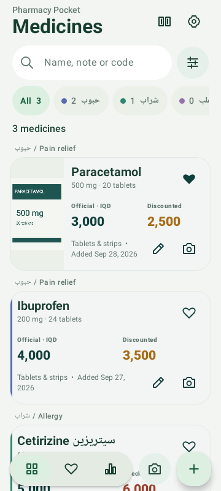
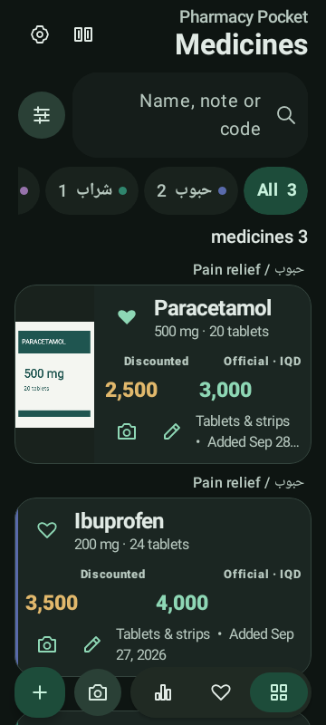
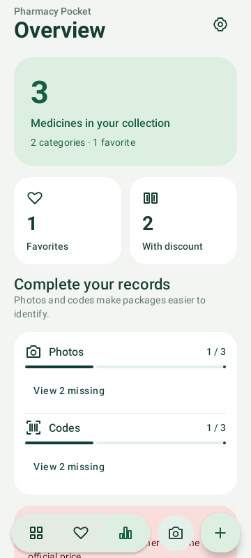
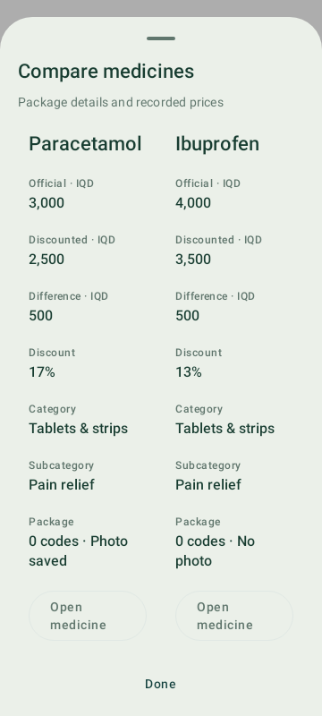
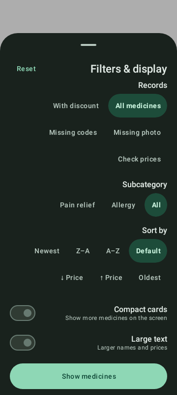
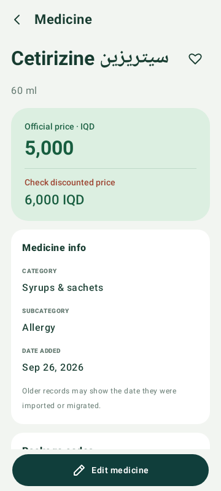

# Medicine library

The library uses a June-inspired dock, grouped Material surfaces and an explicit view-state owner. The implementation is independent of June and introduces no new runtime dependencies or database schema changes.

## Navigation and workflows

- **Medicines**: searchable collection, category pills ordered by record count and one-tap editor/camera actions.
- **Favorites**: the same library restricted to saved favorites. Removing a favorite updates the results immediately.
- **Overview**: category counts, photos/codes coverage, discounted records and inconsistent-price checks. Tap an overview action to open its matching records with old searches/filters cleared.
- **Filters & display**: subcategories, sorting, record-maintenance filters, compact cards and the existing persistent large-text preference. All filters combine with category, query and the Favorites tab.
- **Comparison**: use the compare button or long-press a medicine, then tap up to three medicines and press Compare. Selection uses stable record IDs and survives filtering. Prices/package details are compared; the app does not infer therapeutic equivalence. Rows stay aligned across languages and large font sizes, and the table scrolls in both directions.
- **Search**: whitespace-separated words must all match, in any order, across the name, note, description, subcategory and raw codes. Arabic normalization still applies.
- **Medicine detail**: clear official/discounted prices, calculated savings, selectable/copyable raw codes, text sharing through Android and a fixed Edit action above navigation insets.

## Data and accessibility

Missing-photo and missing-code filters describe stored record metadata. They do not imply stock or clinical status. A price warning means only that the recorded discounted amount exceeds the official amount. Overview counts are computed from current local records, not cached counters.

Comparison removes IDs deleted from the current snapshot. Selecting a fourth medicine does not replace an existing selection. Back cancels selection; dismissing the comparison table keeps the selection for editing. Favorite, edit, photo and camera actions remain independent of selection.

View state uses the existing saved-state scope so opening an editor/detail and returning preserves the library. Theme and large-text preferences retain their existing persistence. Compact mode, filters and comparison are view state, not backup fields.

Photos retain the bounded physical-left rail and full-image popup behavior from the photo layout fix. The camera/gallery/crop/draft/database path is unchanged. The redesigned price inputs stack vertically to remain readable on narrow screens and with large text.

## Verification

`CollectionToolsTest` covers Arabic/code search with favorite scoping, record coverage, invalid price relationships, maximum supported price values, percentage arithmetic and comparison limits.

`LibraryWorkflowTest` exercises Favorites + record filters + reset, overview navigation from a stale query, comparison selection/navigation, and light/dark/RTL rendering on a 360dp phone. It writes actual Compose screenshots with synthetic test package artwork to `app/build/reports/ui/`.

The existing card-layout, photo-state, crop, camera/gallery-to-database and storage tests remain part of `testDebugUnitTest`.

## Rendered screens

Actual Compose rendering with synthetic sample records on a 360dp phone.

| Library | Dark / RTL / larger text |
| --- | --- |
|  |  |

| Overview | Comparison |
| --- | --- |
|  |  |

| Filters | Medicine detail |
| --- | --- |
|  |  |
